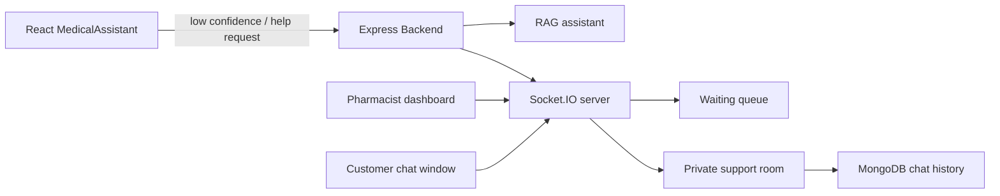

# PharmaHub Pharmacist Support Chat Plan

This is the implementation blueprint for adding a real-time pharmacist support chat to PharmaHub.
It is written as a build plan, not as code, so you can follow it one file at a time.

## Goal

When the AI medical assistant cannot answer confidently, the user should be able to hand off the conversation to a live pharmacist without refreshing the page.

The support chat should provide:

- real-time messages
- private rooms
- waiting queue
- pharmacist dashboard
- typing indicator
- online/offline status
- chat history
- chat end flow

## Important Product Decision

Version 1 should run on a single Node.js server.

Do not add Redis Pub/Sub yet.
Do not split the support chat into a separate service yet.
Keep the first version simple and easy to debug.

## How It Fits Into PharmaHub

Your current project already has:

- the AI medical assistant UI in `my-react-app/frontend/src/pages/MedicalAssistant.jsx`
- the AI response API in `my-react-app/backend/controllers/medicalAssistantController.js`
- the RAG client in `my-react-app/backend/services/ragClient.js`
- the RAG fallback in `my-react-app/backend/services/rag/retrieval.js`

That means the pharmacist chat should be added as a separate human-support layer, not inside the RAG service.

## Recommended Architecture



## Folder Architecture

Use the current backend and frontend structure, then add support-chat-specific files beside the existing RAG code.

### Backend

```text
my-react-app/backend/
  server.js
  routes/
    medicalAssistantRoutes.js
    supportRoutes.js
  controllers/
    medicalAssistantController.js
    supportController.js
  models/
    Chat.js
    SupportRoom.js
  middleware/
    socketAuth.js
  socket/
    socket.js
    roomManager.js
    events.js
  services/
    ragClient.js
    rag/
      safety.js
      retrieval.js
      medicineKnowledge.js
```

### Frontend

```text
my-react-app/frontend/src/
  pages/
    MedicalAssistant.jsx
    SupportChat.jsx
    PharmacistDashboard.jsx
  components/
    ChatWindow.jsx
    ChatInput.jsx
    MessageBubble.jsx
  hooks/
    useSocket.js
  context/
    SocketContext.jsx
```

## What To Reuse

Do not rewrite these files from scratch:

- `my-react-app/frontend/src/pages/MedicalAssistant.jsx`
- `my-react-app/backend/controllers/medicalAssistantController.js`
- `my-react-app/backend/services/ragClient.js`
- `my-react-app/backend/services/rag/safety.js`

These already handle the AI chat and give you the handoff point for human escalation.

## What To Add

### Backend files to add

1. `my-react-app/backend/socket/socket.js`
   - Create the Socket.IO server.
   - Attach auth middleware.
   - Register socket events.

2. `my-react-app/backend/socket/roomManager.js`
   - Keep in-memory queue and room state for version 1.
   - Handle customer waiting rooms and pharmacist assignment.

3. `my-react-app/backend/socket/events.js`
   - Keep event names in one file so the frontend and backend stay consistent.

4. `my-react-app/backend/models/SupportRoom.js`
   - Store room metadata.
   - Track status, customer, pharmacist, timestamps, and source conversation.

5. `my-react-app/backend/models/Chat.js`
   - Store each message.
   - Keep roomId, senderId, senderRole, text, and timestamps.

6. `my-react-app/backend/controllers/supportController.js`
   - Handle REST endpoints for history, room list, and end-chat actions.

7. `my-react-app/backend/routes/supportRoutes.js`
   - Expose the support REST endpoints.

8. `my-react-app/backend/middleware/socketAuth.js`
   - Verify JWT for socket connections.
   - Attach `userId` and `role` to the socket.

### Frontend files to add

1. `my-react-app/frontend/src/context/SocketContext.jsx`
   - Create and share the socket instance.

2. `my-react-app/frontend/src/hooks/useSocket.js`
   - Add a clean hook for socket setup and cleanup.

3. `my-react-app/frontend/src/pages/SupportChat.jsx`
   - Customer support chat screen.

4. `my-react-app/frontend/src/pages/PharmacistDashboard.jsx`
   - Pharmacist queue and active rooms screen.

5. `my-react-app/frontend/src/components/ChatWindow.jsx`
   - Message list and typing state.

6. `my-react-app/frontend/src/components/ChatInput.jsx`
   - Message composer and send button.

7. `my-react-app/frontend/src/components/MessageBubble.jsx`
   - Individual message presentation.

## Database Design

### SupportRoom

```js
{
  roomId,
  customerId,
  pharmacistId,
  status, // waiting | active | closed
  sourceConversationId,
  initialQuestion,
  aiAnswer,
  confidence,
  createdAt,
  closedAt
}
```

### Chat

```js
{
  roomId,
  senderId,
  senderRole, // customer | pharmacist | system
  message,
  messageType, // text | system
  seen,
  createdAt
}
```

## Socket Events

### Client to Server

- `join-support`
- `accept-chat`
- `join-room`
- `send-message`
- `typing`
- `stop-typing`
- `leave-room`
- `disconnect`

### Server to Client

- `support-requested`
- `room-created`
- `receive-message`
- `typing`
- `stop-typing`
- `chat-ended`
- `online-status`
- `error`

## End-to-End Flow

### Customer flow

1. User asks a question in the AI assistant.
2. The AI answers normally if confidence is good.
3. If confidence is low, show a `Need human help` button.
4. Customer clicks the button.
5. App creates or opens a support room.
6. Customer waits in the queue.
7. Pharmacist accepts the room.
8. Both users join the private socket room.
9. Messages are sent in real time.
10. Chat history is saved in MongoDB.
11. Chat is closed when either side ends it.

### Pharmacist flow

1. Pharmacist opens the dashboard.
2. Dashboard shows waiting customers.
3. Pharmacist accepts one queue item.
4. The pharmacist enters the private room.
5. Pharmacist sees the customer question and AI context.
6. Pharmacist chats live with the customer.
7. Pharmacist ends the chat when the issue is resolved.

## Backend Build Order

Build the backend in this order:

1. Add Socket.IO to `my-react-app/backend/server.js`.
2. Add socket auth middleware.
3. Add `SupportRoom` and `Chat` models.
4. Add the socket event layer.
5. Add queue and room management.
6. Add REST endpoints for history and room management.
7. Save messages to MongoDB.
8. Add clean room close logic.

## Frontend Build Order

Build the frontend in this order:

1. Add socket context and hook.
2. Add a `Need human help` action in `MedicalAssistant.jsx`.
3. Create customer support chat page.
4. Create pharmacist dashboard page.
5. Create reusable chat components.
6. Add typing indicator and online status.
7. Add chat history loading.
8. Add end-chat and room-switch behavior.

## How The Handoff Should Work

The best handoff point is already in the AI page.

Use the current response fields from `MedicalAssistant.jsx`:

- `confidence`
- `needsUrgentCare`
- `generationError`
- `conversationId`
- `citations`

Suggested rule:

- if `needsUrgentCare` is true, do not send the user to pharmacist chat
- if `confidence` is low, show a human-help button
- if `generationError` exists, offer escalation

## Security Rules

Keep these rules from day one:

- authenticate all socket connections with JWT
- never allow a client to join a room they do not own
- validate every message on the server
- sanitize user text before saving
- rate-limit message sending
- keep rooms private

## What To Show In The Pharmacist Dashboard

The dashboard should show:

- online/offline status
- waiting queue count
- active chats
- customer name or ID
- initial AI question
- AI confidence
- time waiting
- accept and end buttons

## What To Show In The Customer Chat

The customer screen should show:

- queue status
- assigned pharmacist status
- live messages
- typing indicator
- history
- end chat action

## Suggested API Endpoints

Use REST for history and room management.

```http
GET /support/rooms
GET /support/messages/:roomId
GET /support/history/:roomId
POST /support/end-chat
```

Use Socket.IO for live communication.

## Scaling Note

Version 1 should be single-server only.

Later, if you need multiple Node instances, then add:

- Redis Pub/Sub
- shared presence storage
- shared queue storage

Do not add that complexity in the first version.

## Interview Explanation

If asked how you would build it, say:

> I would keep the AI assistant and the pharmacist chat separate. The AI handles routine questions, and when confidence is low or the user asks for help, the app creates a private Socket.IO support room. The backend stores rooms and messages in MongoDB, and the pharmacist dashboard accepts waiting customers in real time.

## Build Checklist

- [ ] Add Socket.IO to the backend server
- [ ] Add JWT socket authentication
- [ ] Add `SupportRoom` and `Chat` models
- [ ] Add support queue and room manager
- [ ] Add customer support chat UI
- [ ] Add pharmacist dashboard UI
- [ ] Save and load chat history
- [ ] Add typing and online indicators
- [ ] Add end-chat flow
- [ ] Test handoff from AI to human support

## Recommended First Version

Keep the first version small:

- one support queue
- one pharmacist dashboard
- one private chat room per customer
- message history in MongoDB
- Socket.IO for live updates
- JWT auth

That is enough to make the feature feel real and interview-ready without overengineering it.

