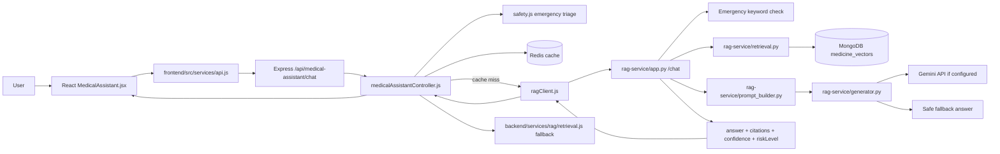
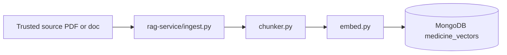

# PharmaHub RAG Architecture and Flow

This document explains the current medical RAG system in the codebase in a simple, code-first way.

## Big Picture

The assistant works like this:

`React UI -> Express backend -> safety/cache -> FastAPI RAG service -> MongoDB retrieval -> prompt builder -> Gemini or fallback -> response`

The app also has a local Node fallback so the medical assistant can still answer basic questions if the Python service is down.

## Current Runtime Architecture

## Ingestion Architecture

The ingestion path is separate from the request path. It prepares the knowledge base that retrieval uses later.

## Request Flow

### 1. User asks a question in the UI

- File: [my-react-app/frontend/src/pages/MedicalAssistant.jsx](../my-react-app/frontend/src/pages/MedicalAssistant.jsx)
- The page collects the user message and sends it with Axios.
- Axios base URL comes from [my-react-app/frontend/src/services/api.js](../my-react-app/frontend/src/services/api.js).

### 2. Express receives the request

- Route: [my-react-app/backend/routes/medicalAssistantRoutes.js](../my-react-app/backend/routes/medicalAssistantRoutes.js)
- Controller: [my-react-app/backend/controllers/medicalAssistantController.js](../my-react-app/backend/controllers/medicalAssistantController.js)
- The controller is the traffic cop for validation, safety, caching, and fallback.

### 3. Safety check runs first

- File: [my-react-app/backend/services/rag/safety.js](../my-react-app/backend/services/rag/safety.js)
- It checks for emergency phrases such as chest pain, trouble breathing, seizure, and suicidal thoughts.
- If the message is urgent, the system returns a high-risk emergency response immediately.

### 4. Redis cache is checked

- File: [my-react-app/backend/controllers/medicalAssistantController.js](../my-react-app/backend/controllers/medicalAssistantController.js)
- The controller hashes the normalized question and checks Redis.
- If the same question was answered recently, the cached response is returned.

### 5. Backend calls the FastAPI RAG service

- File: [my-react-app/backend/services/ragClient.js](../my-react-app/backend/services/ragClient.js)
- The Node backend sends the request to `RAG_SERVICE_URL`, which is the Python service in Docker or local dev.
- The backend normalizes the response shape so the frontend always gets the same contract.

### 6. FastAPI handles retrieval and generation

- Entry file: [rag-service/app.py](../rag-service/app.py)
- It normalizes the message again, checks urgent symptoms, runs retrieval, builds the prompt, and generates the answer.

### 7. Retrieval finds the best context

- File: [rag-service/retrieval.py](../rag-service/retrieval.py)
- It creates a deterministic embedding for the question using [rag-service/embed.py](../rag-service/embed.py).
- It tries MongoDB Atlas vector search first.
- It also runs keyword search as a fallback.
- The two result sets are merged and ranked.

### 8. Prompt building grounds the answer

- File: [rag-service/prompt_builder.py](../rag-service/prompt_builder.py)
- The question plus retrieved snippets are turned into a prompt that tells the model to answer only from the retrieved context.

### 9. Generation produces the final answer

- File: [rag-service/generator.py](../rag-service/generator.py)
- If `GEMINI_API_KEY` is available, Gemini generates the answer.
- If Gemini is missing, rate limited, or fails, the service returns a safe fallback answer instead of breaking.

### 10. Response returns to the UI

The Python service returns:

- `answer`
- `citations`
- `confidence`
- `riskLevel`
- `needsUrgentCare`
- `retrievalMode`
- `generationProvider`

The Node controller may cache that response and then send it back to the React UI.

## Why There Are Two Retrieval Paths

The current project uses two layers:

- Python FastAPI RAG service: the primary retrieval and generation path.
- Node local fallback: a smaller keyword-based medicine knowledge path in [my-react-app/backend/services/rag/retrieval.js](../my-react-app/backend/services/rag/retrieval.js).

That means:

- normal requests should use the Python RAG service
- if the Python service is unavailable, the backend still has a basic answer path

## Code Map

| Layer | Main files | Responsibility |
| --- | --- | --- |
| Frontend | `frontend/src/pages/MedicalAssistant.jsx` | Chat UI, prompts, citations, confidence display |
| Frontend API | `frontend/src/services/api.js` | Axios base URL for backend calls |
| Express backend | `backend/server.js`, `backend/routes/medicalAssistantRoutes.js`, `backend/controllers/medicalAssistantController.js` | Routing, validation, safety, Redis cache, fallback |
| Node RAG client | `backend/services/ragClient.js` | Calls the FastAPI service |
| Node fallback RAG | `backend/services/rag/retrieval.js`, `backend/services/rag/medicineKnowledge.js` | Lightweight local answer path |
| Python RAG API | `rag-service/app.py` | Final chat contract |
| Python retrieval | `rag-service/retrieval.py`, `rag-service/embed.py` | Vector and keyword retrieval |
| Python prompting | `rag-service/prompt_builder.py` | Builds the grounded prompt |
| Python generation | `rag-service/generator.py` | Gemini call or safe fallback |
| Ingestion | `rag-service/ingest.py`, `rag-service/chunker.py`, `rag-service/pdf_loader.py` | Builds the knowledge base |
| Storage | MongoDB, Redis | Vector store and short-lived cache |

## Data Flow In One Line

`User question -> safety check -> cache -> retrieval -> prompt -> generation -> cited answer -> UI`

## Ingestion Flow In One Line

`Trusted source PDF -> text extraction -> chunking -> embedding -> MongoDB vector store`

## Environment Variables That Matter

- `MONGO_URI`
- `REDIS_URL`
- `RAG_SERVICE_URL`
- `RAG_SERVICE_TIMEOUT_MS`
- `GEMINI_API_KEY`
- `GEMINI_MODEL`

## How To Read The System

If you want to understand the code in order, read these files in this sequence:

1. [my-react-app/frontend/src/pages/MedicalAssistant.jsx](../my-react-app/frontend/src/pages/MedicalAssistant.jsx)
2. [my-react-app/frontend/src/services/api.js](../my-react-app/frontend/src/services/api.js)
3. [my-react-app/backend/routes/medicalAssistantRoutes.js](../my-react-app/backend/routes/medicalAssistantRoutes.js)
4. [my-react-app/backend/controllers/medicalAssistantController.js](../my-react-app/backend/controllers/medicalAssistantController.js)
5. [my-react-app/backend/services/ragClient.js](../my-react-app/backend/services/ragClient.js)
6. [rag-service/app.py](../rag-service/app.py)
7. [rag-service/retrieval.py](../rag-service/retrieval.py)
8. [rag-service/prompt_builder.py](../rag-service/prompt_builder.py)
9. [rag-service/generator.py](../rag-service/generator.py)

## Mental Model

Think of the system in three jobs:

- `Frontend` asks the question and shows the answer.
- `Backend` keeps the request safe, cached, and routed correctly.
- `RAG service` finds the right medical context and generates the final answer.
